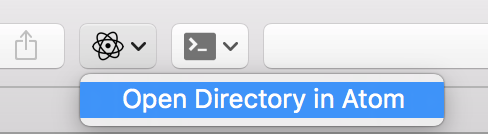
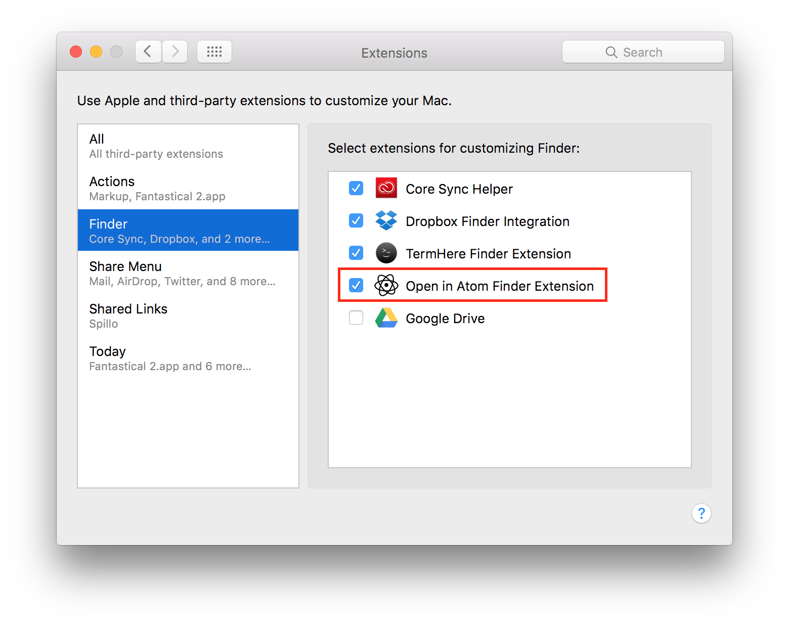

# “Open in Atom” Finder Extension

## macOS Sierra (10.12) Incompatibility

A combination of sandboxing changes and other bugs makes it impossible for this tool to work. I’ve spent a few hours over the course of several weeks looking for a workaround, including using different `NSWorkspace` APIs and a few different scripting-based approaches (both using Scripting Bridge and embedded AppleScripts).

Ultimately I decided that this had already taken more time and headaches than it was worth; Finder extensions and sandboxing problems are both independently difficult to debug, and when combined they’re incredibly frustrating to work with.

I think there probably is a solution involving writing an out-of-process service and communicating with it via XPC. After all, [TermHere](https://hbang.ws/apps/termhere/) ([available on GitHub](https://github.com/hbang/TermHere)) makes this work somehow. (I noticed that TermHere [has a commit which adds some editor-related preferences](https://github.com/hbang/TermHere/commit/8f22feaba4e7167489aebc7508395b5ae31f9e94), so maybe similar “open in $EDITOR” support will come to that app someday.)

### An AppleScript “Open in Atom” Solution

**On Sierra and later, I recommend the following solution.**

Based on [this comment from Nick Vance](https://github.com/cdzombak/finder-atom/issues/3#issuecomment-313317763), the [v2.0 products](https://github.com/cdzombak/finder-atom/tree/master/products/2.0/) directory contains two products:

* A script which you can install and run via [FastScripts](https://red-sweater.com/fastscripts/) _(this script is not code-signed)_
* An application which you can command-drag into your Finder toolbar. _(this application **is** code-signed)_

These products are also available as [the latest release, currently 2.0](https://github.com/cdzombak/finder-atom/releases/latest).

#### Compatibility

Developed and tested on macOS 10.12.6. (The AppleScript-based products should work with OS X 10.11, too.)

## Author & Contributors

This tooling was written by [Chris Dzombak](https://www.dzombak.com).

[Nick Vance](https://github.com/nickv2002) is a significant contributor to the AppleScript-based products. [View other contributors on GitHub](https://github.com/cdzombak/finder-atom/graphs/contributors).

## License

See [`LICENSE.md`](LICENSE.md).

---

## “Open in Atom” Finder Extension for OS X 10.11

An “Open Directory in Atom” button for your Finder toolbar, on OS X 10.11:

### Installation

1. Download and decompress [the 1.2 release](https://github.com/cdzombak/finder-atom/releases/tag/v1.2), which is the last release supporting OS X 10.11.
2. Copy `Open in Atom for Finder.app` to your `Applications` folder.
3. Launch the app.
4. Open System Preferences > Extensions and enable the “Open in Atom Finder Extension”:

    

### Compatibility

Developed and tested on OS X 10.11.6. **Incompatible with macOS 10.12 or later.**

### Development

Simply clone the repo; building and archiving the project should be straightforward. There are no dependencies.
